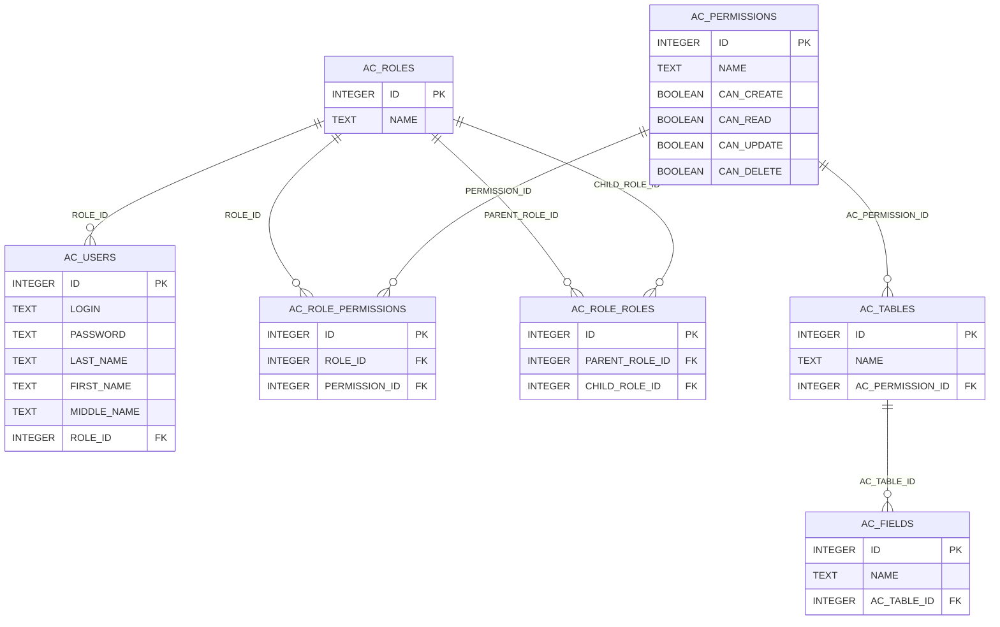

# Схема базы данных контроля доступа

Светосила v1.0. Спецификации на разработку

**Последнее изменение:** 17.12.2025, 12:00 МСК

```mermaid
erDiagram
    AC_ROLES ||--o{ AC_USERS : "ROLE_ID"
    AC_ROLES ||--o{ AC_ROLE_PERMISSIONS : "ROLE_ID"
    AC_PERMISSIONS ||--o{ AC_ROLE_PERMISSIONS : "PERMISSION_ID"
    AC_ROLES ||--o{ AC_ROLE_ROLES : "PARENT_ROLE_ID"
    AC_ROLES ||--o{ AC_ROLE_ROLES : "CHILD_ROLE_ID"

    AC_USERS {
        INTEGER ID PK
        TEXT LOGIN
        TEXT PASSWORD
        TEXT LAST_NAME
        TEXT FIRST_NAME
        TEXT MIDDLE_NAME
        INTEGER ROLE_ID FK
    }

    AC_ROLES {
        INTEGER ID PK
        TEXT NAME
    }

    AC_PERMISSIONS {
        INTEGER ID PK
        TEXT NAME
        BOOLEAN CAN_CREATE
        BOOLEAN CAN_READ
        BOOLEAN CAN_UPDATE
        BOOLEAN CAN_DELETE
    }

    AC_ROLE_PERMISSIONS {
        INTEGER ID PK
        INTEGER ROLE_ID FK
        INTEGER PERMISSION_ID FK
    }

    AC_ROLE_ROLES {
        INTEGER ID PK
        INTEGER PARENT_ROLE_ID FK
        INTEGER CHILD_ROLE_ID FK
    }

    AC_PERMISSIONS ||--o{ AC_TABLES : "AC_PERMISSION_ID"
    AC_TABLES ||--o{ AC_FIELDS : "AC_TABLE_ID"

    AC_TABLES {
        INTEGER ID PK
        TEXT NAME
        INTEGER AC_PERMISSION_ID FK
    }

    AC_FIELDS {
        INTEGER ID PK
        TEXT NAME
        INTEGER AC_TABLE_ID FK
    }
```
