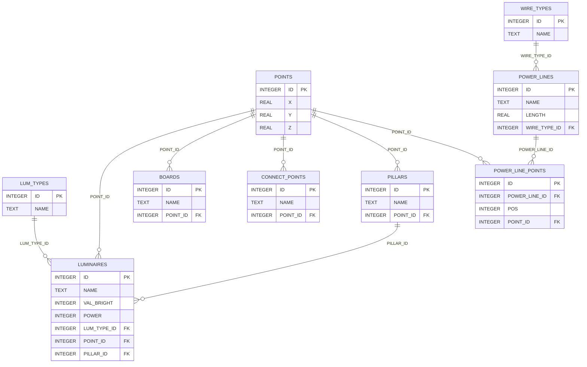

# Схема базы данных

Светосила v1.0. Спецификации на разработку

**Последнее изменение:** 17.12.2025, 12:00 МСК

```mermaid
erDiagram
    LUM_TYPES ||--o{ LUMINAIRES : "LUM_TYPE_ID"
    POINTS ||--o{ LUMINAIRES : "POINT_ID"
    PILLARS ||--o{ LUMINAIRES : "PILLAR_ID"
    POINTS ||--o{ BOARDS : "POINT_ID"
    POINTS ||--o{ CONNECT_POINTS : "POINT_ID"
    POINTS ||--o{ PILLARS : "POINT_ID"
    POINTS ||--o{ POWER_LINE_POINTS : "POINT_ID"
    WIRE_TYPES ||--o{ POWER_LINES : "WIRE_TYPE_ID"
    POWER_LINES ||--o{ POWER_LINE_POINTS : "POWER_LINE_ID"

    LUMINAIRES {
        INTEGER ID PK
        TEXT NAME
        INTEGER VAL_BRIGHT
        INTEGER POWER
        INTEGER LUM_TYPE_ID FK
        INTEGER POINT_ID FK
        INTEGER PILLAR_ID FK
    }

    LUM_TYPES {
        INTEGER ID PK
        TEXT NAME
    }

    POINTS {
        INTEGER ID PK
        REAL X
        REAL Y
        REAL Z
    }

    BOARDS {
        INTEGER ID PK
        TEXT NAME
        INTEGER POINT_ID FK
    }

    CONNECT_POINTS {
        INTEGER ID PK
        TEXT NAME
        INTEGER POINT_ID FK
    }

    POWER_LINES {
        INTEGER ID PK
        TEXT NAME
        REAL LENGTH
        INTEGER WIRE_TYPE_ID FK
    }

    POWER_LINE_POINTS {
        INTEGER ID PK
        INTEGER POWER_LINE_ID FK
        INTEGER POS
        INTEGER POINT_ID FK
    }

    WIRE_TYPES {
        INTEGER ID PK
        TEXT NAME
    }

    PILLARS {
        INTEGER ID PK
        TEXT NAME
        INTEGER POINT_ID FK
    }
```

