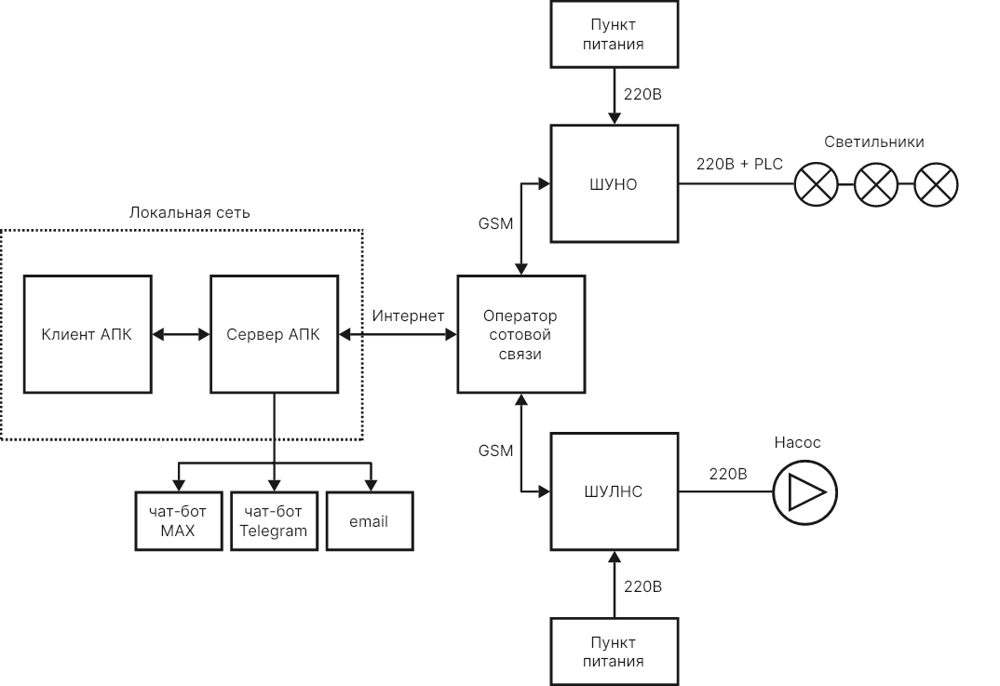

# ТЕХНИЧЕСКОЕ ЗАДАНИЕ

На внедрение аппаратно-программного комплекса AWADA (ООО Авада Системс) в деятельность АО «ПО КХ г.о. Тольятти» по содержанию и эксплуатации сетей водоотведения и освещения.

**Последнее изменение:** 26.01.2026, 12:54 МСК

## 1. Термины и определения

1.1. АПК - аппаратно-программный комплекс.

1.2. Клиент АПК - интерфейсное приложение, через которое пользователь взаимодействует с комплексом.

1.3. Сервер АПК - центральный компьютер комплекса, с которым взаимодействуют клиенты АПК, управляющий контроллерами автоматики и поддерживающий базу данных комплекса.

1.4. Устройство - инженерное устройство (светильник, насос, контроллер...).

1.5. Соединение - средство для передачи ресурса, вещества или информации (электрокабель, трубопровод...).

1.6. Несущая конструкция - сооружение для монтажа устройств или прокладки соединений (опора, эстакада, коллектор...).

1.7. Оборудование - устройства, соединения и несущие конструкции.

1.8. Подсистема - часть инженерной системы, которая выполняет специфическую функцию (освещение, водоотведение...).

1.9. Цифровая тень - виртуальная модель системы инженерных устройств (цифровой двойник), используемая в АПК AWADA для управления оборудованием. Включает в себя представленные в 3D-пространстве оборудование, здания и сооружения, карту территории. Устройства в модели снабжаются параметрами, необходимыми для автоматизированного управления ими.

## 2. Цели внедрения

2.1. Автоматизация учета сетей водоотведения и освещения.

2.2. Автоматизация эксплуатационных, регламентных и ремонтных работ.

2.3. Формирование отчетности по работе оборудования.

## 3. Структура комплекса

где:

ШУНО - шкаф управления наружным освещением.

ШУЛНС - шкаф управления ливневой насосной станцией.

PLC - Power Line Communication, технология для передачи цифровой информации по проводам, которые одновременно используются для передачи электроэнергии.

## 4. Функционал комплекса

### 4.1. Интерфейс пользователя

4.1.1. Клиент АПК реализован в виде веб-приложения. Пользователь работает с комплексом, заходя из браузера своего ПК или мобильного устройства на веб-портал сервера АПК.

4.1.2. Пользователю предоставляются два варианта работы с оборудованием инженерных систем:

- 3D-карта - с геопривязкой оборудования.
- Табличный вид - с отображением оборудования в виде электронной таблицы.

4.1.3. Независимо от выбранного варианта отображения пользователь имеет возможность как показать/скрыть оборудование любой подсистемы (водоотведение, освещение), так и ограничить перечень выводимого оборудования с помощью настраиваемых фильтров.

4.1.4. Каждое устройство, соединение, несущая конструкция имеет свою страницу-мнемосхему (карточку), вид которой зависит от типа объекта.

### 4.2. Формирование цифровой тени

4.2.1. При внедрении комплекса на территориально-распределенном объекте (как в данном случае) в качестве основы для создания цифровой тени и геопривязки инженерного оборудования применяется 3D-карта.

4.2.2. 3D-карта хранится локально на сервере АПК и является копией карты сервиса OpenStreetMap. При переносе данных из OpenStreetMap берется область карты, достаточная для размещения всего автоматизируемого инженерного оборудования.

4.2.3. При необходимости актуализации 3D-карты она может быть повторно импортирована из сервиса OpenStreetMap. Оборудование и его геопривязка при этом не меняются.

4.2.4. Ориентируясь с помощью 3D-карты, пользователь комплекса добавляет в цифровую тень инженерное оборудование с указанием точек его расположения на плоскости и высоты относительно уровня земли, формирует инженерные сети, увязывая в одну систему устройства, соединения между ними и несущие конструкции.

### 4.3. Настройка и управление устройствами

4.3.1. На стадии пуско-наладочных работ комплекс позволяет:
- конфигурировать устройства;
- формировать группы устройств (группы светильников).

4.3.2. С помощью комплекса пользователь может формировать расписание работы устройств (расписание работы освещения).

4.3.3. Комплекс предоставляет возможность оперативного управления:
- светильниками и группами светильников;
- оборудованием насосных станций водоотведения.

### 4.4. Учет эксплуатируемого оборудования

4.4.1. Каждое устройство, соединение, несущая конструкция может снабжаться произвольным изменяемым набором пользовательских параметров, необходимых для целей учета оборудования.

4.4.2. Перечень таких параметров для каждого типа оборудования может редактироваться, как на стадии внедрения комплекса, так и при последующей эксплуатации.

4.4.3. Пользовательские параметры имеют вид: Название параметра - Тип - Значение.

4.4.4. Одним из типов параметра является выбор из справочника. Создание и ведение справочников может производиться либо при внедрении, либо при последующей эксплуатации.

### 4.5. События и телеметрия

4.5.1. Действия пользователей, аварийные события, периоды отсутствия связи, действия сервера АПК, команды контроллеров исполнительным устройствам, телеметрия от приборов и прочая подобная информация сохраняются в единую базу на сервере АПК.

4.5.2. Если данные о событиях ввиду отсутствия связи не могут быть оперативно переданы от контроллеров в шкафах управления, они накапливаются контроллерами локально и при восстановлении связи передаются серверу АПК.

4.5.3. Пользователю через клиент АПК в виде журнала предоставляется возможность просматривать поток событий, используя различные фильтры.

4.5.4. Пользователь имеет возможность настроить отправку определенных событий себе в чат-бот или в email-ящик.

### 4.6. Отчетность и аналитика

4.6.1. Комплекс предоставляет инструмент для создания шаблонов отчетов. Шаблоны позволяют формировать отчеты по всей имеющейся в базе данных сервера АПК информации за произвольные периоды времени.

4.6.2. Настроенные и сохраненные шаблоны отчетов могут использовать все пользователи комплекса.

4.6.3. Пользователь может настроить периодическую отправку формирующихся по шаблонам отчетов в чат-боты и email-ящик.

### 4.7. Руководство пользователя

4.7.1. Клиент АПК снабжается интерактивной контекстно-зависимой онлайн-справкой, в которой в зависимости от раздела, где находится пользователь, будет объяснен интерфейс и предложены варианты действий пользователя.

### 4.8. Интеграция с внешними программными средствами

4.8.1. Обмен данными со сторонним программным обеспечением осуществляется с помощью импорта/экспорта файлов форматов:
- CSV - данные в табличном виде.
- JSON - данные в структурированном виде.

4.8.2. Для оперативного информирования персонала о происходящих в рамках комплекса событиях применяется интеграция с чат-ботами MAX, Telegram и email-ящиком пользователя.

### 4.9. Ограничение прав доступа

4.9.1. Ограничение прав доступа к функционалу комплекса реализуется с помощью интегрированной в АПК системы контроля доступа.

4.9.2. Аутентификация пользователя осуществляется с использованием логина и пароля.

4.9.3. Администрированием прав доступа занимается уполномоченный сотрудник организации-заказчика.

4.9.4. Администратор создает пользователей и назначает им роли, дающие права на выполнение действий.

4.9.5. Администратор может создавать новые роли, давать им права на действия, включать одни роли в другие, выстраивая тем самым иерархию ролей.

4.9.6. Администратор имеет возможность отслеживать активность пользователей: входы в систему (сессии), выполненные действия.

## 5. Перечень работ по внедрению

5.1. Формирование цифровой тени: создание устройств, соединений, несущих конструкций и нанесение их на карту.

5.2. Пуско-наладочные работы: конфигурирование устройств.

5.3. Организация учета оборудования: создание пользовательских параметров у оборудования, создание и заполнение справочников.

5.4. Настройка отчетности: создание инфошаблонов и панелей мониторинга.

5.5. Построение системы ограничения прав доступа: создание действий, ролей, пользователей.

## 6. Этапы внедрения

В процессе...

