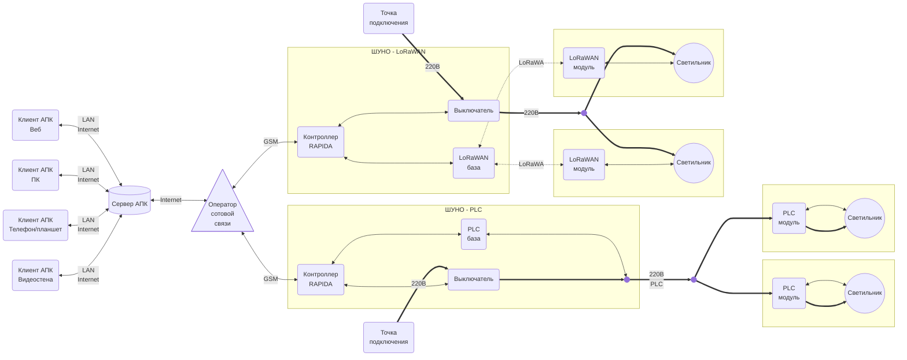

# Техническое задание

АПК Светосила. Версия:MAX

**Последнее изменение:** 26.12.2025

## 1. Термины и определения

1.1. АПК - аппаратно-программный коплекс.

1.2. АСУНО - автоматизированная система управления наружным освещенеим.

1.3. ШУНО - шкаф управлнетя наружным освещением

1.4. IoT - Internet of Things, Интернет вещей — это концепция, при которой физические устройства подключены к интернету, собирают данные, обмениваются ими и могут автоматически выполнять действия без постоянного участия человека.

1.4. LoRaWAN - Long Range Wide Area Network, протокол беспроводной связи для построения сетей Интернета вещей (IoT).

1.5. PLC - Power Line Communication, технология для передачи цифровой информации по проводам, которые одновременно используются для передачи электроэнергии.

1.6. DALI, DALI-2 - цифровые портоколы для организации проводной системы управления освещением.

1.6. D4i - стандарт, расширяющий DALI-2 IoT‑функциями и дополнительными возможностями диагностики светильников.

## 2. Назначение компекса

2.1. АПК предназначен для создания автоматизированной системы управления наружным освещенеим (АСУНО).

## 3. функции комплекса

3.1. Формирование и актуализация информационной модели системы освещения: объекты инфраструктуры (светильники, ШУНО, кабельные линии, несущие конструкции и т.д.) и связи между ними.

3.2. Мониторинг текущего состояния системы.

3.3. Оперативное управление светильниками и другими объектами инфрастурктуры.

3.4. Настройка автоматической работы освещения.

3.3. Оперативное информирование персонала об нештитных ситуациях и "автоматизация" работ по их устранению.

3.4. "Автоматизация" ремонтных и регламентных работ.

3.5. Интеграция с системой видеонаблюдения.

3.6. Хранение данных телеметрии, действий пользователей.

3.7. Отчетность и аналитика по сохраненным данным.

3.8. Ограничение пользователям прав доступа к управлению и данным.

3.9. Интерфейс пользователя:  веб-приложение, приложение на ПК, мобильное прложение, видеостена.

3.10. Информирование пользователя: элетропочта, СМС, Телеграм/Макс.

3.15. Использование ИИ.

## 3. Состав комплекса

3.1. LoRaWAN-молули - устройства индивидуалного упарвления светильниками, устанавыливаемые непосредственно на светилнтках и обеспечивающие беспроводную связь с останым АПК по технологии LoRaWAN.

D4i
PLC

3.2. Шкафы управлнетя наружным освещением (ШУНО) - комплекты оборудования АСУНО поддерживающие связь с одной стороны со светильниками по LoRaWAN, с лругой с сервером АПК через GSM/TCP/IP - соединение. В состав ШУНО входят:

3.2.1. Контроллеры RAPIDA.
3.2.2. Счетчики электоэнергии.
3.2.3. Силовые эелкроаппараты. 
3.2.4. Устройства связи.
3.2.5. Датчики.

3.3. Сервер АПК с серверным приложением и базой данных АПК.

3.4. Клиентские веб-приложения АПК, работающие на ПК пользователей и имеющие с сервером АПК TCP/IP-соединение.

3.5. Схема АПК:

## 4. LoRaWAN-модули

4.1. Модули устанвливаются на светильники посредством Zhaga-разъема.

4.2. Модули обеспечивают автономную атоматическую работу:
- по расписанию
- по восходу/закату
- по датчику освещенности

4.3. Выбор режимма и его настройка осуществляется пользовтелями через клиенты АПК.

4.4. Модули поддерживают индивидуальное и групповое оперативное управление яркостью светильников.

4.5. Оперативное управление осуществляется с помощью клиетов АПК.

## 5. ШУНО

5.1. ШУНО - металлический шкаф в пыле-влагозащищеном антивандальном исполнении.

5.2. Дверь шкафа оборудуется датчиком открытия.

5.3. Оборудование шкафа:

5.3.1. **Контроллер AWADA RAPIDA** - управляет светильниками, подключенными к шкафу; взаимодействует с сервером АПК.

5.3.2. **Автоматические выключатели** - стоят на силовых линиях, питающих светильники; имеют функционал телемеханики (состояние, включение/выключение).

5.3.3. **Счетчик электроэнергии** - телеметрия энергопотребления системы освещения.

5.3.4. **GSM-модем** - TCP/IP-связь контроллера с сервером АПК.

5.3.5. **Базовая снация LoRaWAN** - связь контроллера с модулями LoRaWAN светильников.

## 6. Сервер АПК

интеграция со сторонними сервисами

6.1. Является веб-сервером для клиентов АПК.

6.2. Взаимодействует с контоллерами RAPIDA ШУНО.

6.3. Хранит базу данных АПК: текущую конфигурацию АСУНО, насторойки и теушее состояние устройств, архив.

6.4. Является сервером системы ограничения прав доступа.

6.5. Является сервером LLM.

## 7. Клиенты АПК

видеостена, нативные: ПК, Андро\иОС
интеграция с текущим клиентом

7.1. Клиент - веб-приложение, арботающие в браузере на устройстве пользователя.

7.2. В качестве веб-сервера использует серевер АПК.

7.3. Имеет инетрфейс адаптированый под испльзование на ПК, планшете, телефоне.

7.4. Обеспечивает:

7.4.1. Доступ к данным согласно правам доступа пользоватеоя.

7.4.2. Настроцку и оперативное управление оборудованием.

7.4.3. Изменение конфигурации АСУНО (добавление/удаление/изменение светильников/ШУНО/линий электропередачи т.п.)

7.4.4. Формирование отчетности по работе АСУНО.

