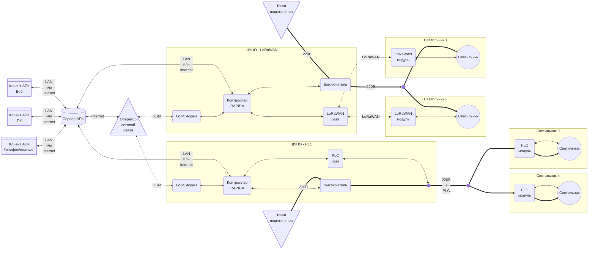

# Техническое задание

АПК Светосила. В максимальной версии

**Последнее изменение:** 29.12.2025, 13:39 МСК

## 1. Термины и определения

1.1. АПК - аппаратно-программный комплекс.

1.2. АСУНО - автоматизированная система управления наружным освещением.

1.3. ШУНО - шкаф управления наружным освещением.

1.4. IoT - Internet of Things, Интернет вещей — это концепция, при которой физические устройства подключены к интернету, собирают данные, обмениваются ими и могут автоматически выполнять действия без постоянного участия человека.

1.5. LoRaWAN - Long Range Wide Area Network, протокол беспроводной связи для построения сетей Интернета вещей (IoT). В рамках АПК используется для организации связи со светильниками по радиоканалу.

1.6. PLC - Power Line Communication, технология для передачи цифровой информации по проводам, которые одновременно используются для передачи электроэнергии.

1.7. DALI, DALI-2 - цифровые протоколы для организации проводной системы управления освещением.

1.8. D4i - стандарт, расширяющий DALI-2 IoT‑функциями и дополнительными возможностями диагностики светильников.

1.9. LLM - Large Language Model, большая языковая модель, используемая в АПК в качестве искуственнго интеллекта (ИИ).

## 2. Назначение

2.1. АПК предназначен для создания автоматизированной системы управления наружным освещением (АСУНО).

## 3. Функции

3.1. АПК выполняет следующие функции:

3.1.1. Формирование и актуализация информационной модели системы освещения.

3.1.2. Мониторинг текущего состояния системы.

3.1.3. Оперативное управление светильниками и другими объектами инфраструктуры.

3.1.4. Настройка автоматической работы освещения.

3.1.5. Оперативное информирование персонала о нештатных ситуациях.

3.1.6. Организация жизненного цикла эксплуатационных, регламентных и ремонтных работ.

3.1.7. Интеграция с системой видеонаблюдения.

3.1.8. Хранение данных телеметрии и действий пользователей.

3.1.9. Формирование отчетности и аналитики.

3.1.10. Ограничение прав доступа пользователей к управлению и данным.

3.1.11. Предосталение различных вариантов интерфейса пользователя.

3.1.12. Оперативное информирование пользователей.

3.1.13. Использование ИИ в качестве ассистента пользователя.

3.1.14. Использование ИИ в качестве агента в АПК.

### 3.2. Формирование и актуализация информационной модели системы освещения

### 3.3. Мониторинг текущего состояния системы

### 3.4. Оперативное управление светильниками и другими объектами инфраструктуры

### 3.5. Настройка автоматической работы освещения

### 3.6. Оперативное информирование персонала о нештатных ситуациях

### 3.7. Организация жизненного цикла эксплуатационных, регламентных и ремонтных работ

9.1. Формирование и инициация работ на основании событий, регламентов или управленческих решений.

9.2. Назначение исполнителей, ресурсов и сроков.

9.3. Регламентация порядка выполнения работ.

9.4. Фиксация хода и результатов выполнения.

9.5. Мониторинг текущего состояния и отклонений.

9.6. Контроль завершения и закрытия работ.

9.7. Документирование и хранение информации для последующего анализа и аудита.

### 3.8. Интеграция с системой видеонаблюдения

### 3.9. Хранение данных телеметрии и действий пользователей

### 3.10. Формирование отчетности и аналитики

### 3.11. Ограничение прав доступа пользователей к управлению и данным

### 3.12. Предосталение различных вариантов интерфейса пользователя

### 3.13. Оперативное информирование пользователей

### 3.14. Использование ИИ в качестве ассистента пользователя

### 3.15. Использование ИИ в качестве агента в АПК

## 4. Состав

4.1. Схема АПК:

### 4.2. LoRaWAN-модули

.1. LoRaWAN-модули - устройства индивидуального управления светильниками, устанавливаемые непосредственно на светильниках и обеспечивающие беспроводную связь с остальным АПК по технологии LoRaWAN.

5.1. Модули устанавливаются на светильники посредством Zhaga-разъема.

5.2. Модули обеспечивают автономную автоматическую работу:

- по расписанию
- по восходу/закату
- по датчику освещенности

5.3. Выбор режима и его настройка осуществляется пользователями через клиенты АПК.

5.4. Модули поддерживают индивидуальное и групповое оперативное управление яркостью светильников.

5.5. Оперативное управление осуществляется с помощью клиентов АПК.

### 4.3. PLC-модули

5.1. Модули устанавливаются в светильники или в непосредственной близости от них.

5.2. Модули соединяются со светильниками силовыми линиями 220В и кабелями управления.

### 4.4 ШУНО

4.2. Шкафы управления наружным освещением (ШУНО) - комплекты оборудования АСУНО, поддерживающие связь, с одной стороны, со светильниками по LoRaWAN, с другой - с сервером АПК через GSM/TCP/IP-соединение. В состав ШУНО входят:
6.1. ШУНО - металлический шкаф в пылевлагозащищенном антивандальном исполнении.

6.2. Дверь шкафа оборудуется датчиком открытия.

6.3. Оборудование шкафа:

6.3.1. **Контроллер AWADA RAPIDA** - управляет светильниками, подключенными к шкафу; взаимодействует с сервером АПК.

6.3.2. **Выключатели** - стоят на силовых линиях, питающих светильники; имеют функционал телемеханики (состояние, включение/выключение).

6.3.3. **Счетчик электроэнергии** - телеметрия энергопотребления системы освещения.

6.3.4. **GSM модем** - TCP/IP-связь контроллера с сервером АПК.

6.3.5. **База LoRaWAN** - беспроводная связь контроллера с модулями LoRaWAN светильников.

6.3.6. **База PLC** - связь контроллера с модулями PLC светильников по линиям 220В.

### 4.5. Сервер АПК

7.1. Интеграция со сторонними сервисами.

7.2. Является веб-сервером для клиентов АПК.

7.3. Взаимодействует с контроллерами RAPIDA ШУНО.

7.4. Хранит базу данных АПК: текущую конфигурацию АСУНО, настройки и текущее состояние устройств, архив.

7.5. Является сервером системы ограничения прав доступа.

7.6. Является сервером LLM.

### 4.6. Клиенты АПК

8.1. Нативные: ПК, Android/iOS.
8.2. Интеграция с текущим клиентом.

8.3. Клиент - веб-приложение, работающее в браузере на устройстве пользователя.

8.4. В качестве веб-сервера использует сервер АПК.

8.5. Имеет интерфейс, адаптированный под использование на ПК, планшете, телефоне.

8.6. Обеспечивает:

8.6.1. Доступ к данным согласно правам доступа пользователя.

8.6.2. Настройку и оперативное управление оборудованием.

8.6.3. Изменение конфигурации АСУНО (добавление/удаление/изменение светильников/ШУНО/линий электропередачи и т.п.).

8.6.4. Формирование отчетности по работе АСУНО.

## Вопросы

1. PLC без D4i?
2. LoRa (светильник) без D4i бывает?
3. Нужны ли недимм светильники?

