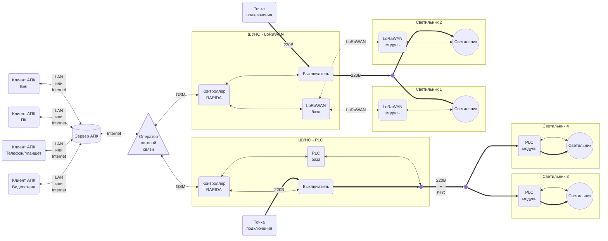

# Техническое задание

АПК Светосила. В максимальной версии

**Последнее изменение:** 29.12.2025, 13:39 МСК

## 1. Термины и определения

1.1. АПК - аппаратно-программный комплекс.

1.2. АСУНО - автоматизированная система управления наружным освещением.

1.3. ШУНО - шкаф управления наружным освещением.

1.4. IoT - Internet of Things, Интернет вещей — это концепция, при которой физические устройства подключены к интернету, собирают данные, обмениваются ими и могут автоматически выполнять действия без постоянного участия человека.

1.5. LoRaWAN - Long Range Wide Area Network, протокол беспроводной связи для построения сетей Интернета вещей (IoT).

1.6. PLC - Power Line Communication, технология для передачи цифровой информации по проводам, которые одновременно используются для передачи электроэнергии.

1.7. DALI, DALI-2 - цифровые протоколы для организации проводной системы управления освещением.

1.8. D4i - стандарт, расширяющий DALI-2 IoT‑функциями и дополнительными возможностями диагностики светильников.

## 2. Назначение комплекса

2.1. АПК предназначен для создания автоматизированной системы управления наружным освещением (АСУНО).

## 3. Функции комплекса

3.1. Формирование и актуализация информационной модели системы освещения: объекты инфраструктуры (светильники, ШУНО, кабельные линии, несущие конструкции и т.д.) и связи между ними.

3.2. Мониторинг текущего состояния системы.

3.3. Оперативное управление светильниками и другими объектами инфраструктуры.

3.4. Настройка автоматической работы освещения.

3.5. Оперативное информирование персонала о нештатных ситуациях.

3.6. Организация жизненного цикла эксплуатационных, регламентных и ремонтных работ.

3.7. Интеграция с системой видеонаблюдения.

3.8. Хранение данных телеметрии, действий пользователей.

3.9. Отчетность и аналитика по сохраненным данным.

3.10. Ограничение прав доступа пользователей к управлению и данным.

3.11. Интерфейс пользователя: веб-приложение, приложение на ПК, мобильное приложение, видеостена.

3.12. Информирование пользователя: электропочта, СМС, сервисы обмена сообщениями.

3.13. Использование ИИ в качестве ассистента пользователя.

3.14. Использование ИИ в качестве агента в АПК.

## 4. Состав комплекса

4.1. LoRaWAN-модули - устройства индивидуального управления светильниками, устанавливаемые непосредственно на светильниках и обеспечивающие беспроводную связь с остальным АПК по технологии LoRaWAN.

4.1.1. D4i
4.1.2. PLC

4.2. Шкафы управления наружным освещением (ШУНО) - комплекты оборудования АСУНО, поддерживающие связь, с одной стороны, со светильниками по LoRaWAN, с другой - с сервером АПК через GSM/TCP/IP-соединение. В состав ШУНО входят:

4.2.1. Контроллеры RAPIDA.
4.2.2. Счетчики электроэнергии.
4.2.3. Силовые электроаппараты.
4.2.4. Устройства связи.
4.2.5. Датчики.

4.3. Сервер АПК с серверным приложением и базой данных АПК.

4.4. Клиентские веб-приложения АПК, работающие на ПК пользователей и имеющие с сервером АПК TCP/IP-соединение.

4.5. Схема АПК:

## 5. LoRaWAN-модули

5.1. Модули устанавливаются на светильники посредством Zhaga-разъема.

5.2. Модули обеспечивают автономную автоматическую работу:

- по расписанию
- по восходу/закату
- по датчику освещенности

5.3. Выбор режима и его настройка осуществляется пользователями через клиенты АПК.

5.4. Модули поддерживают индивидуальное и групповое оперативное управление яркостью светильников.

5.5. Оперативное управление осуществляется с помощью клиентов АПК.

## 6. ШУНО

6.1. ШУНО - металлический шкаф в пылевлагозащищенном антивандальном исполнении.

6.2. Дверь шкафа оборудуется датчиком открытия.

6.3. Оборудование шкафа:

6.3.1. **Контроллер AWADA RAPIDA** - управляет светильниками, подключенными к шкафу; взаимодействует с сервером АПК.

6.3.2. **Автоматические выключатели** - стоят на силовых линиях, питающих светильники; имеют функционал телемеханики (состояние, включение/выключение).

6.3.3. **Счетчик электроэнергии** - телеметрия энергопотребления системы освещения.

6.3.4. **GSM-модем** - TCP/IP-связь контроллера с сервером АПК.

6.3.5. **Базовая станция LoRaWAN** - связь контроллера с модулями LoRaWAN светильников.

## 7. Сервер АПК

7.1. Интеграция со сторонними сервисами.

7.2. Является веб-сервером для клиентов АПК.

7.3. Взаимодействует с контроллерами RAPIDA ШУНО.

7.4. Хранит базу данных АПК: текущую конфигурацию АСУНО, настройки и текущее состояние устройств, архив.

7.5. Является сервером системы ограничения прав доступа.

7.6. Является сервером LLM.

## 8. Клиенты АПК

8.1. Видеостена, нативные: ПК, Android/iOS.
8.2. Интеграция с текущим клиентом.

8.3. Клиент - веб-приложение, работающее в браузере на устройстве пользователя.

8.4. В качестве веб-сервера использует сервер АПК.

8.5. Имеет интерфейс, адаптированный под использование на ПК, планшете, телефоне.

8.6. Обеспечивает:

8.6.1. Доступ к данным согласно правам доступа пользователя.

8.6.2. Настройку и оперативное управление оборудованием.

8.6.3. Изменение конфигурации АСУНО (добавление/удаление/изменение светильников/ШУНО/линий электропередачи и т.п.).

8.6.4. Формирование отчетности по работе АСУНО.

## 9. Организация жизненного цикла эксплуатационных, регламентных и ремонтных работ.

9.1. Формирование и инициация работ на основании событий, регламентов или управленческих решений.

9.2. Назначение исполнителей, ресурсов и сроков.

9.3. Регламентация порядка выполнения работ.

9.4. Фиксация хода и результатов выполнения.

9.5. Мониторинг текущего состояния и отклонений.

9.6. Контроль завершения и закрытия работ.

9.7. Документирование и хранение информации для последующего анализа и аудита.

