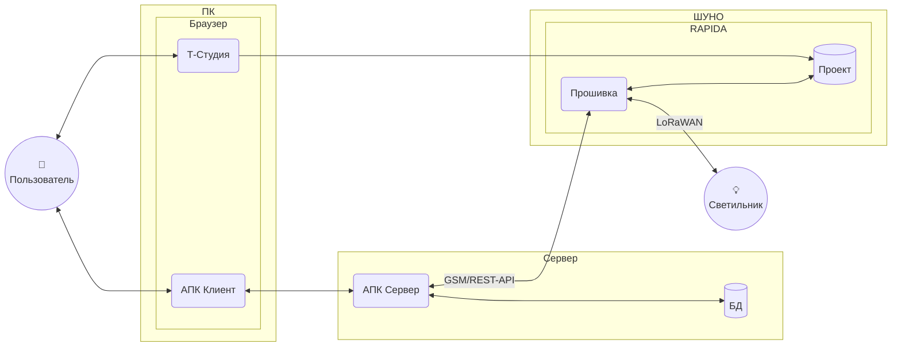

# Схема АПК

```mermaid

flowchart LR
  USER((🧔<br>Пользователь))

  subgraph ПК
    subgraph Браузер
      FE(АПК Клиент)
      TS(Т-Студия)
    end
  end

  subgraph Сервер
    direction TB
     BE(АПК Сервер)
     DB[(БД)]
  end

  subgraph ШУНО
    subgraph RAPIDA
      FW(Прошивка)
      PR[(Проект)]
    end
  end

  LUM((💡<br>Светильник))

  USER <---> FE
  FE <---> BE
  BE <--GSM/REST-API--> FW
  FW <--LoRaWAN--> LUM
  BE <---> DB
  FW <---> PR
  USER <---> TS
  TS ---> PR
```